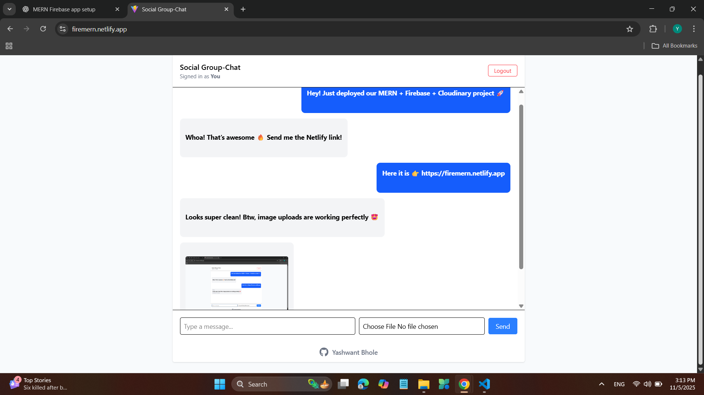
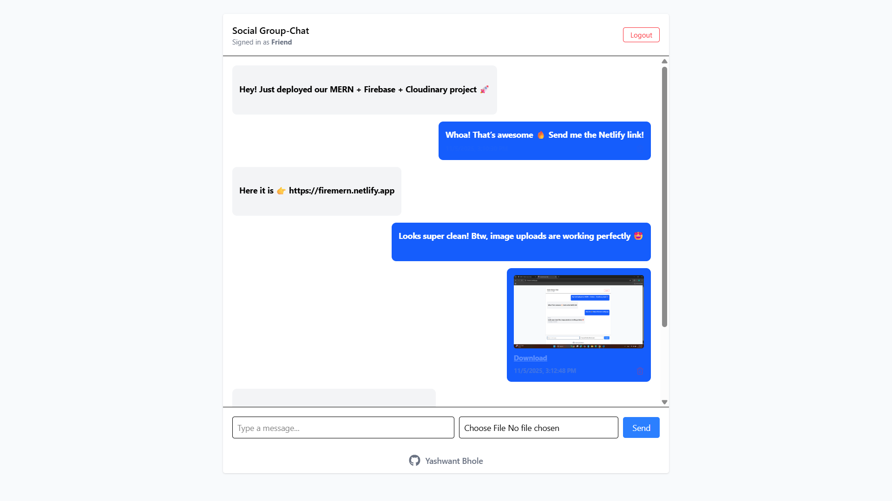
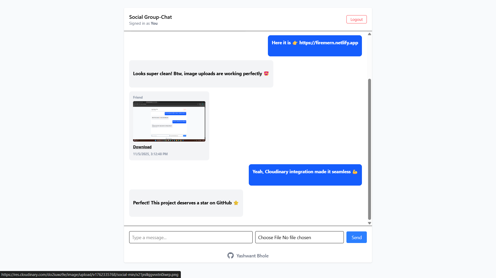
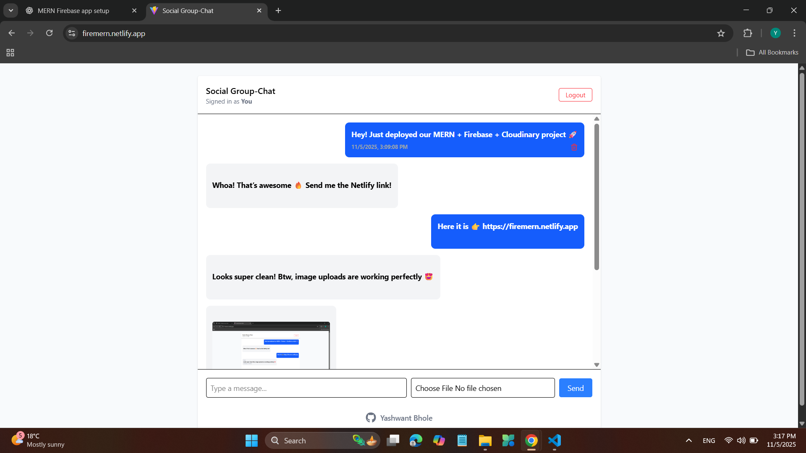

## 💬 Simple Social Chat App

A real-time group chat app built with ⚛️ React, 🟩 Node.js/Express, ⚡ Socket.io, 🔥 Firebase Cloud Messaging (FCM), and ☁️ Cloudinary.
It features instant text & image sharing, smart notifications, and a sleek responsive UI — all powered by the MERN stack + Cloud services.

---
👉 [Social Chat App Backend Repository](https://github.com/YashwantBhole/MERN-Social-ChatApp-Backend)
---

## 🌟 Features 

- ✅ Live Chat — Real-time messaging powered by Socket.io
- 🖋️ Text Messages — Clean and responsive chat bubbles
- 🖼️ Image Uploads — Preview, download, and delete (up to 5 MB) 
- 🔔 Push Notifications — Firebase Cloud Messaging (FCM) integration
- ☁️ Cloud Storage — Secure image hosting with Cloudinary
- 🗑️ Message Deletion — Remove your own texts or images anytime
- 👋 User Logout — Simple session handling
- 📱 Responsive UI — Built with Tailwind CSS for all devices
- 🕒 Hover Details — Timestamp + delete icon shown on hover

---

## 🔗 Live Links

- 🌐 Frontend: [Click here](http://firemern.netlify.app/)
- ⚙️ Backend API: [Click here](https://mern-social-chatapp-backend.onrender.com)

---

## 🖥️ Demo Screenshots

**1️⃣ Dashboard/Home Page**  

**2️⃣ Chat Interface(user1)**  

**3️⃣ Chat Interface(user2)**  

**4️⃣ Real-Time Updates**  

---

## 🛠️ Tech Stack

### ⚛️ **Frontend**
- ⚡ [**React**](https://react.dev/) – Dynamic and reactive user interface  
- 🚀 [**Vite**](https://vitejs.dev/) – Lightning-fast build tool for modern frontend development  
- 🎨 [**Tailwind CSS**](https://tailwindcss.com/) – Utility-first CSS framework for clean responsive design  
- 🌐 [**Axios**](https://axios-http.com/) – Simplified HTTP requests for API communication  
- 🔔 [**Firebase Cloud Messaging (FCM)**](https://firebase.google.com/docs/cloud-messaging) – Real-time web push notifications  
- 🌍 [**Netlify**](https://www.netlify.com/) – Fast and reliable frontend deployment platform  

---

### 🧠 **Backend**
- 🟩 [**Node.js**](https://nodejs.org/) – JavaScript runtime for building scalable backend services  
- ⚙️ [**Express.js**](https://expressjs.com/) – Minimal and efficient web framework for backend APIs  
- 💬 [**Socket.io**](https://socket.io/) – Real-time, bidirectional communication between clients and server  
- 🗄️ [**MongoDB Atlas**](https://www.mongodb.com/atlas) – Cloud NoSQL database for message and user storage  
- 🧩 [**Mongoose**](https://mongoosejs.com/) – Elegant ODM (Object Data Modeling) for MongoDB  
- ☁️ [**Cloudinary**](https://cloudinary.com/) – Cloud-based image storage and optimization  
- 🔥 [**Firebase Admin SDK**](https://firebase.google.com/docs/admin/setup) – Server-side handling for push notifications  
- 🛜 [**Render**](https://render.com/) – Scalable cloud hosting for backend services  
- 🔐 [**dotenv**](https://www.npmjs.com/package/dotenv) – Secure environment variable management  
- 🔁 [**CORS**](https://www.npmjs.com/package/cors) – Enables secure cross-origin resource sharing  

---

⚡ How It Works
💬 Real-time Messaging

Socket.io connects all users instantly.

Every message is broadcast live across clients.

🖼️ Image Uploads

Upload images ≤ 5 MB → sent to /api/upload.

Stored securely on Cloudinary → returned as an image URL.

Displayed instantly in chat.

🔔 Firebase Cloud Messaging

FCM initialized in both client & server.

Sends push notifications to all connected users (except sender).

Invalid tokens are auto-cleaned.

🗑️ Message Deletion & Metadata

Delete your messages (text/image).

Hover shows timestamp ⏰ + delete icon 🗑️.

📱 Responsive Design

Tailwind CSS makes the layout fluid across mobile & desktop.

Images and text scale beautifully with smooth animations.

---

## Getting Started

### Prerequisites

- Node.js v18+  
- MongoDB database (local or cloud)  
- Cloudinary account  
- Firebase project with service account

---

### Setup Backend

### 1. Clone the Repository
       git clone https://github.com/your-username/social-app.git
       cd notes-app

---

 ## 👤 Author & Connect With Me

### **Yashwant Bhole**

  
  
  
  

💼 *Full Stack Developer — MERN • Java • Spring Boot*  
🌟 *Building AI-powered systems with clean architecture and strong UI/UX.*

---

## ⭐ Feedback

If you found this project helpful, please ⭐ **star** the repository — it encourages me a lot!
